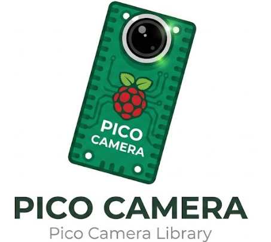
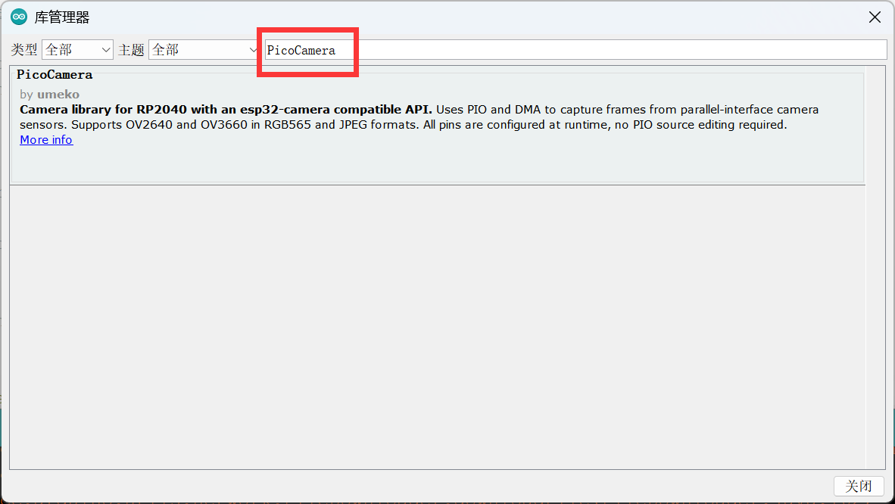
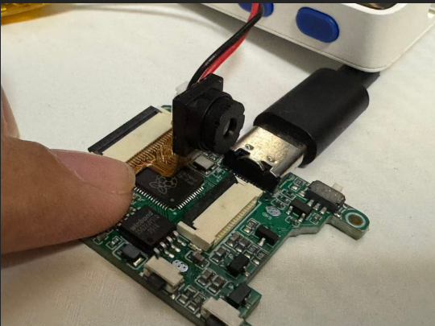
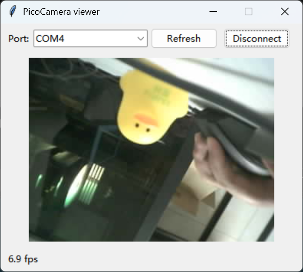

# PicoCamera

<p align="center">
  
</p>

[English](https://github.com/umeiko/PicoCamera/blob/main/readme.md) · **中文**

📖 **在线文档：** [中文](https://umeiko.github.io/PicoCamera/zh/) · [English](https://umeiko.github.io/PicoCamera/)

RP2040 摄像头库，API 与 [esp32-camera](https://github.com/espressif/esp32-camera) 对齐（`esp_` 前缀换成 `pico_`），基于 PIO + DMA 采集。

- 所有引脚（含 VSYNC/HREF/PCLK/数据线）都在 `camera_config_t` 里运行时配置，无需修改 PIO 源码
- 不依赖 pioasm 构建步骤，Arduino IDE / PlatformIO 直接可用
- 自动探测传感器型号（SCCB 读 PID）

## 支持的传感器

| 传感器 | RGB565 | JPEG | 状态 |
|--------|--------|------|------|
| OV2640 | ✅ | ✅ | 已硬件验证 |
| OV3660 | ✅ | ✅ | 已硬件验证 |
| OV7670 | ✅ | ❌（无编码器） | 已硬件验证 |

传感器控制（`sensor->set_vflip` 等）：OV2640 较完整（翻转/镜像/亮度/对比度/饱和度/白平衡/曝光/特效/质量……）；OV3660 目前实现了 vflip/hmirror/framesize/pixformat;OV7670 实现了 vflip/hmirror/白平衡/增益/曝光/彩条，更多按需补充。

**对无 JPEG 编码器的传感器（如 OV7670）请求 JPEG**,`pico_camera_init()` 会返回 `PICO_CAMERA_ERR_NOT_SUPPORTED`——与 esp32-camera 行为一致。`frame_size` 超过传感器上限时不报错，告警并钳位到最大值。

## 安装

### Arduino IDE

PicoCamera 已上架 Arduino 库管理器：打开 **工具 → 管理库...**（或 速写 → 包含库 → 管理库），搜索 **PicoCamera** 点击安装即可。

<p align="center">
  
</p>

也可以手动安装：把本仓库放入 `Arduino/libraries/`，或打包为 zip 通过「添加 .ZIP 库」安装。

### PlatformIO

PicoCamera 已上架 [PlatformIO Registry](https://registry.platformio.org/libraries/umeiko/PicoCamera)：

```ini
lib_deps =
    umeiko/PicoCamera@^0.3.0
```

也可以直接用 git 地址（`lib_deps = https://github.com/umeiko/PicoCamera.git`）或本地 `file://` 路径。

### Pico SDK（裸 CMake 工程）

本库是纯 Pico SDK 代码（不依赖 Arduino），裸 CMake 工程可以直接引入（要求 SDK ≥ 1.5.0）：

```cmake
add_subdirectory(path/to/PicoCamera)
target_link_libraries(my_app pico_stdlib pico_camera)
```

完整工程见 [examples/pico_sdk_capture](https://github.com/umeiko/PicoCamera/tree/main/examples/pico_sdk_capture)，细节见[使用指南](docs/user_guide_zh.md)。

Arduino / PlatformIO 两种方式需要 earlephilhower 的 [arduino-pico](https://github.com/earlephilhower/arduino-pico) 核心。

### 如果核心已经内置了 PicoCamera

较新的 arduino-pico 版本可能自带一份 PicoCamera。你自己安装的副本（Library Manager、PlatformIO `lib_deps`、git）始终优先于内置副本，因此无需等待核心发版就能用上最新版。可以用 `pico_camera.h` 里的宏确认当前编译进程序的是哪个版本：

```cpp
Serial.println(PICO_CAMERA_VERSION_STRING);        // 例如 "0.3.0"
#if PICO_CAMERA_VERSION_HEX >= 0x00030000          // 特性开关
...
#endif
```

## 快速开始

<p align="center">
  
  <br>
  <i>RP2040 开发板通过 FPC 排线连接 OV2640/OV3660 摄像头模组</i>
</p>

```cpp
#include <PicoCamera.h>

camera_config_t config = {
    .pin_pwdn = -1, .pin_reset = 29, .pin_xclk = 5,
    .pin_sccb_sda = 12, .pin_sccb_scl = 13,
    .pin_d0 = 14, .pin_d1 = 15, .pin_d2 = 16, .pin_d3 = 17,
    .pin_d4 = 18, .pin_d5 = 19, .pin_d6 = 20, .pin_d7 = 21,
    .pin_vsync = 2, .pin_href = 3, .pin_pclk = 4,
    .xclk_freq_hz = 10000000,
    .sccb_i2c_port = 0,
    .pixel_format = PIXFORMAT_RGB565,   // 或 PIXFORMAT_JPEG
    .frame_size = FRAMESIZE_QVGA,
    .jpeg_quality = 10,
    .fb_count = 1,
};

void setup() {
    pico_camera_init(&config);
}

void loop() {
    camera_fb_t *fb = pico_camera_fb_get();
    if (fb) {
        // fb->buf / fb->len / fb->width / fb->height
        // JPEG 模式下 buf 是完整 JPEG 文件（FFD8...FFD9）
        pico_camera_fb_return(fb);
    }
}
```

传感器控制：

```cpp
sensor_t *s = pico_camera_sensor_get();
if (s) {
    if (s->set_vflip)   s->set_vflip(s, 1);
    if (s->set_quality) s->set_quality(s, 10);
}
```

## 与 esp32-camera 的差异

- 数据引脚 `pin_d0..pin_d7` 必须是 **8 个连续 GPIO**（PIO `in pins` 指令的硬件限制），初始化时会校验
- 无 PSRAM 概念，帧缓冲在 SRAM（264KB）。RGB565 建议 ≤ VGA（640x480, 600KB 超 SRAM，实际 QVGA 较稳）；JPEG 缓冲按 `宽×高/4 + 8KB` 估算
- 暂不支持 `grab_mode`：`pico_camera_fb_get()` 是阻塞单帧语义（等价 `CAMERA_GRAB_WHEN_EMPTY`），每次调用同步等下一帧

## 示例

- [CameraSerialInfo](https://github.com/umeiko/PicoCamera/tree/main/examples/CameraSerialInfo) — 探测传感器并打印信息
- [CameraCaptureRGB565](https://github.com/umeiko/PicoCamera/tree/main/examples/CameraCaptureRGB565) — RGB565 抓帧
- [CameraCaptureJPEG](https://github.com/umeiko/PicoCamera/tree/main/examples/CameraCaptureJPEG) — JPEG 抓帧（含 SOI/EOI 完整性检查）
- [camera_render_to_tft](https://github.com/umeiko/PicoCamera/tree/main/examples/camera_render_to_tft) — 通过 TFT_eSPI 在 TFT 屏上实时预览（需先自行配置 TFT_eSPI）
- [push_image_to_python](https://github.com/umeiko/PicoCamera/tree/main/examples/push_image_to_python) — 通过 USB 串口把帧推送给 Python（tkinter）上位机查看器

<p align="center">
  
  <br>
  <i>push_image_to_python：上位机实时渲染 OV2640 JPEG 图像流</i>
</p>

## 文档

- [使用指南](docs/user_guide_zh.md) — 配置项、取帧流程、`camera_fb_t` 与 `sensor_t` 详解（[English](docs/user_guide.md)）
- 完整 API 参考：<https://umeiko.github.io/PicoCamera/zh/>

## 许可证

MIT
